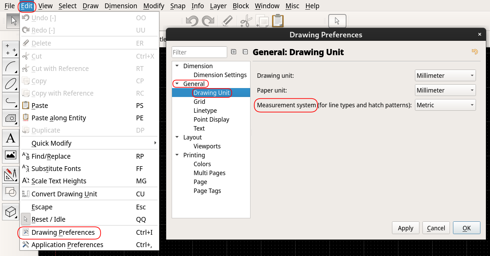
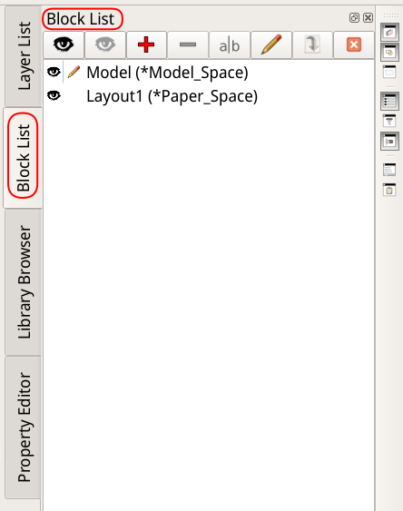
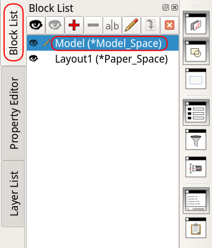
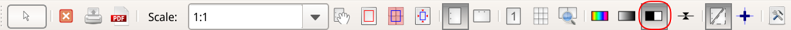
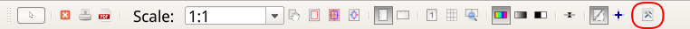
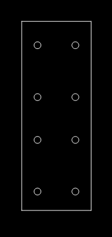
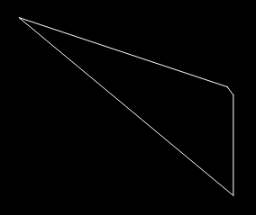
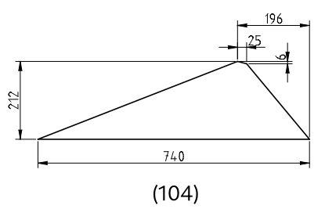
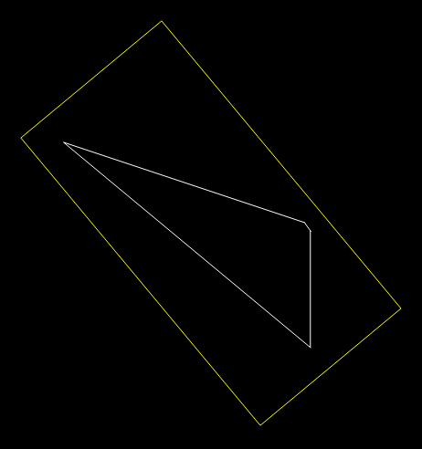
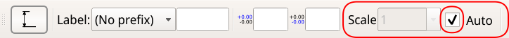

= Przewodnik podstaw QCAD'a Pro
:sectnums:
:sectnumlevels: 5
:toc: left
:toclevels: 5
:toc-title: Przewodnik podstaw QCAD’a Pro

== Wprowadzenie
Ten przewodnik przedstawia podstawy QCAD'a. Wiele efektów w programie QCAD można osiągnąć na wiele sposobów.

Przewodnik nie jest wyczerpującą encyklopedią programu, a raczej stara się przedstawić jeden, wyważony, łatwy w użyciu sposób produkcji rysunków technicznych.

Podane procedury skupiają się na użyciu myszy, ograniczając użycie klawiatury do koniecznego minimum. Powodem jest to, aby uczynić naukę podstaw QCAD'a jak najłatwiejszą, kosztem szybkości rysowania.

=== Konwencje

==== Terminologia

W niektórych kontekstach QCAD używa słowa "_drawing_" na określenie tego, co niniejszy przewodnik nazywa "projektem", czyli pojedynczy plik/dokument QCAD'a.

Przewodnik rezerwuje słowo "rysunek" (ang.: _drawing_) dla pojedynczej "strony wydruku", drukowanej na pojedynczym arkuszu papieru, zwykle z własną ramką i tabliczką.

Dla bardziej szczegółowych wyjaśnień oraz innych haseł zobacz sekcję xref:#glossary[].

==== Ścieżki dostępu
Narzędzia dostępne w programie można wybrać na wiele sposobów. Na przykład, to samo narzędzie można wybrać z menu tekstowego lub klikając ikonę na palecie narzędzi. W większości przypadków, dla uproszczenia i jednoznaczności komunikacji niniejszy przewodnik ogranicza się do wybierania narzędzi z menu tekstowego.

Dotarcie do właściwego narzędzia, opcji lub komendy zwykle wymaga kilku kroków, o których sekwencji można myśleć jako o "ścieżce dostępu". Do reprezentacji tych ścieżek ten przewodnik używa konwencji zilustrowanej następującym przykładem:

`_Edit > *Drawing preferences* > General > Drawing Unit > Measurement system_`

Niektóre z członów ścieżki mogą się odnosić do tekstowych menu, a inne do opcji lub pól w oknach dialogowych. Powyższa, przykładowa ścieżka pozwala na znalezienie pola do ustawienia systemu miar. Jest ona zilustrowana na zrzucie ekranu poniżej; zauważ jak segmenty ścieżki korespondują do elementów zaznaczonych na poniższej ilustracji:

.Przykładowa ścieżka dostępu


Ta konwencja jest używana gdzie jest to tylko możliwe. Tylko w miejscach gdzie jest ona niewystarczająca przewodnik ucieka się do zrzutów ekranu.

Pierwszy człon ścieżki może wskazywać:

* jedno z "menu" wymienionych na liście na górze okna (np. _Edit_ na ilustracji powyżej),
* albo jeden z "kluczowych paneli" po prawej stronie ekranu (np. _Block List_ na poniższej ilustracji):



==== Klikanie
`LMB`:: Pojedyncze kliknięcie lewego klawisza myszy (_Left Mouse Button_).
`LMBx2`:: Dwukrotne kliknięcie lewego klawisza myszy.
`RMB`:: Pojedyncze kliknięcie prawego klawisza myszy (_Right Mouse Button_).

==== Panele
Gdy przewodnik mówi o `_Block List_`,  `_Layer List_`, `_Property Editor_` lub `_Library Browser_`, to odnosi się on do paneli po prawej stronie ekranu.

Rozdział xref:#kluczowe-panele[Włącz kluczowe panele] opisuje jak je włączyć i gdzie je znaleźć.

==== Domyślne ustawienia

W wielu oknach dialogowych przewodnik rekomenduje zmianę pewnych pól, ale ignoruje inne, które mogą być w danym oknie obecne.

W takim przypadku pozostaw the "niewymienione" pola jak są  — chyba, że już je znasz i wiesz jakie są ich funkcje i konsekwencje zmiany ich wartości.

=== Proces rysowania

Przed przystąpieniem do rysowania po raz pierwszy, upewnij się, że program jest właściwie skonfigurowany, wykonując kroki z rozdziału xref:#wstepna-konfiguracja-programu[].

Process tworzenia nowego rysunku sprowadza się do następujących faz:

* xref:#nowy-rysunek[]
* xref:#model[]
* xref:#prezentacja[]

Każda z tych faz opisana jest w indywidualnych rozdziałach poniżej.

[#wstepna-konfiguracja-programu]
== Skonfiguruj QCAD'a

Instrukcje w tej sekcji zwykle wystarczy wykonać tylko raz, jako że ustawiają one konfigurację całego programu i dla wszystkich nowo tworzonych projektów. Może się zdarzyć, że po re-instalacji lub po instalacji nowszej wersji programu, niektóre z ustawień trzeba będzie przejrzeć i powtórzyć.

[#kluczowe-panele]
=== Włącz kluczowe panele
Upewnij się, że powyższe opcje są zaznaczone/aktywne:

* `_View > Block List_`
* `_View > Layer List_`
* `_View > Property Editor_`
* `_View > Library Browser_`

Gdy te opcje są _zaznaczone_, korespondujące panele powinny być widoczne po prawej stronie ekranu, wyglądając podobnie jak na poniższych ilustracjach.

Zauważ, że to rozmieszczenie można zmieniać, tak aby dostęp do nich był najwygodniejszy:

[cols="a,a", frame=none, grid=none]
|===
|.Wszystkie panele w tej samej sekcji

|.Panele rozdzielone w dwóch sekcjach
image::img/key_panels_property_editor_separate.png[]
|===

Możesz zmieniać kolejność pionowych zakładek "łapiąc" i przesuwając je kursorem myszy.

Podobnie, łapiąc i przesuwając poziomo zorientowane tytuły paneli, możesz zmienić lokację tych paneli.

=== Wyłącz siatkę

.Dlaczego?
[%collapsible]
====
Siatka rzadko kiedy jest przydatna, a zwykle wchodzi w drogę.

Siatka jest matrycą punktów rozmieszczonych w modelu w równych, pre-definiowanych odstępach. Punkty te mogą być użyte do zgrubnego rozmieszczania obiektów, służąc jako punkty automatycznie przyciągając kursor. W teorii mają one ułatwić rysowanie, ale w praktyce potrzebujemy punktów wynikających z rozmiarów rysowanych obiektów, takich jak końce lini, środki okręgów lub punkty przecięcia lini. Takie punkty, rzadko kiedy wypadają w miejscach punktów siatki.

Jeśli punkt, który naprawdę nas interesuje (np. punkt przecięcia jakiejś lini z okręgiem) wypada blisko punktu siatki, to jest ryzyko, że wskazując go, np. jako początek lub koniec nowo rysowanej lini, automatyczne przyciąganie może nam przyciągnąć kursor do punktu siatki zamiast punktu naszego zainteresowania. W najlepszym przypadku zauważymy to i skorygujemy (kosztem kilku zbędnych kroków). W najgorszym, całkiem prawdopodobnym przypadku, możemy tej niedokładności nie zauważyć. Niewłaściwa pozycja pozostawiona w rysunku i wielokrotnie traktowana jako punkt odniesiena dla kolejnych punktów odniesiena może propagować nawarstwiający się błąd, który będzie tym kosztowniejszy do naprawy im więcej czasu upłynie do jego wykrycia.
====

==== Wyłącz wyświetlanie siatki
`_Edit > *Application* Preferences > *Defaults for New Drawings* > Grid_`:

* Odznacz _Display grid_ w panelach po prawej stronie: _Viewport 1_, _Vieport 2_, _Viewport 3_, _Viewport 4_.

Wyłączenie siatki w tym miejscu spowoduje, że nie będzie ona widoczna w _nowo_ utworzonych rysunkach. Jeśli masz już istniejący rysunek na ekranie, i chcesz wyłączyć siatkę w nim, powtórz powyższy krok w lokacji `_Edit > *Drawing Preferences* > General > Grid_`.

==== Wyłącz automatyczne przyciąganie do punktów siatki
Odznacz: `_Edit > *Application Preferences* > Snap > Auto snap_ > _Grid points_`

=== Ustaw kolor wydruku
Zaznacz: `_Edit > *Application Preferences* > Default for New Drawings > Printing — Colors_ > _Black / white_`

=== Wyłącz wyświetlanie "niedrukowalnych" warstw w podglądzie wydruku
Zaznacz: `_Edit > *Application Preferences* > File > Print Preview_ > _Show only plottable layers_`

=== Włącz podgląd wydruku automatycznie przy wchodzeniu w przestrzeń papieru
Zaznacz: `_Edit > *Application Preferences* > File > Print Preview_ > _Automatically switch print preview on for layout blocks_`

xref:#def-niedrukowalna-warstwa[Co to jest drukowalna i niedrukowalna warstwa?]

=== Włącz wyświetlanie pomiarów w linii komend

Odznacz: `_Edit > *Application Preferences* > Widgets > Command Line > Show information as dialog_`

Odznacz: `_Edit > *Application Preferences* > Widgets > Command Line > Show warnings as dialog_`

=== Włącz linię komend

Zaznacz: `_View > Command Line_` — o ile nie jest już zaznaczone.

=== Włącz wyświetlanie statusu "plottable" in Layer List

Zaznacz: `_Edit > *Application Preferences* > Widgets > Layer List > Show plottable column`

=== Włącz wyświetlanie biblioteki jako listę
W menu `_Edit > *Application Preferences* > Widgets > Library Browser > View mode` wybierz _List_.

=== Ściągnij pliki ramek

Na dysku Twojego komputera (np. w katalogu _Dokumenty_ albo tam gdzie trzymasz swoje projekty) stwórz strukturę katalogów:

```
qcad
└── biblioteka
    └── ramki
```

Ściągnij następujące pliki, jeden po drugim, do tego nowo utworzonego katalogu _ramki_:

* xref:drawings/ramki/ramka A0 pion.dxf[ramka A0 pion.dxf]
* xref:drawings/ramki/ramka A0 poziom.dxf[ramka A0 poziom.dxf]
* xref:drawings/ramki/ramka A1 pion.dxf[ramka A1 pion.dxf]
* xref:drawings/ramki/ramka A1 poziom.dxf[ramka A1 poziom.dxf]
* xref:drawings/ramki/ramka A2 pion.dxf[ramka A2 pion.dxf]
* xref:drawings/ramki/ramka A2 poziom.dxf[ramka A2 poziom.dxf]
* xref:drawings/ramki/ramka A3 pion.dxf[ramka A3 pion.dxf]
* xref:drawings/ramki/ramka A3 poziom.dxf[ramka A3 poziom.dxf]
* xref:drawings/ramki/ramka A4 pion.dxf[ramka A4 pion.dxf]
* xref:drawings/ramki/ramka A4 poziom.dxf[ramka A4 poziom.dxf]
* xref:drawings/ramki/ramka A4 poziom obrocona.dxf[ramka A4 poziom obrocona.dxf]
* xref:drawings/ramki/tabliczka 120x40.dxf[tabliczka 120x40.dxf]

Dodaj je teraz do biblioteki QCAD'a:

* Otwórz: `_Edit > *Application Preferences* > Widgets > Library Browser > Library Sources_`
* W panelu `_Library Sources_` kliknij `_Add_`
* W oknie dialogowym, które się pojawi, znajdź i wejdź do katalogu _ramki_ utworzonego powyżej.
* Kliknij `_Choose_` aby zatwierdzić wybór.
* Kliknij `_OK_` aby zatwierdzić zmiany ustawień.
* Zamknij i otwórz QCAD'a.

=== Ściągnij pliki szablonów rysunków

Na dysku Twojgo komputera, w katalogu _qcad > biblioteka_ (stworzonym w powyższym kroku), utwórz katalog _szablony_:
```
qcad
└── biblioteka
    ├── ramki
    └── szablony
```


Ściągnij następujące pliki, jeden po drugim, do tego nowo utworzonego katalogu _szablony_:

* xref:drawings/szablony/rysunek qcad - wymiary w milimetrach.dxf[rysunek qcad - wymiary w milimetrach.dxf]
* xref:drawings/szablony/rysunek qcad - wymiary w centymetrach.dxf[rysunek qcad - wymiary w centymetrach.dxf]

Zarejestruj pliki szablonów w QCAD'zie:

* Otwórz: `_Edit > *Application Preferences* > File > Templates_`
* W panelu `_File: Templates_` kliknij `_Add_`.
* W oknie dialogowym, które się pojawi, znajdź i wejdź do katalogu _szablony_ utworzonego powyżej.
* Kliknij `_Choose_` aby zatwierdzić wybór.
* Kliknij `_OK_` aby zatwierdzić zmiany ustawień.
* Zamknij i otwórz ponownie QCAD'a.

[#nowy-rysunek]
== Stwórz nowy rysunek

=== Zamknij domyślny, pusty rysunek

W czasie uruchamiania, QCAD automatycznie tworzy pusty rysunek. Jeśli tak właśnie się stało i masz go na ekranie, zamknij ten rysunek (bez zamykania samego programu):

* `_File > Close_`
* wybierz `_Close without Saving_` (o ile program zapyta).

=== Stwórz nowy rysunek z szablonu

* `_File > New from Template..._`
* Wybierz szablon, klikając jeden z poniższych szablonów:
** _rysunek qcad - wymiary w milimetrach_ — dla rysunków stali
** _rysunek qcad - wymiary w centymetrach_ — dla rysunków obiektów murowanych i drewnianych
* Kliknij `_Create New Drawing_` aby stworzyć rysunek.

=== Warstwy
Ściągnięte pliki zawierają kilka użytecznych, już skonfigurowanych warstw. Użyj ich dla uproszczenia rysowania:

* *_konstrukcja_* — tu rysuj swój *model* — elementy stalowe, więźby, mury, etc.
* *_widoki_* — tu umieszczaj widoki elementów *dla wydruku* (jak opisane w xref:#widok-nowy[])
* *_wymiary opisy (model)_* — na tej warstwie umieszczaj pomocnicze opisy i wymiary, które powinny być *widoczne tylko w modelu*, a które nie powinny być drukowane na papierze. Innymi słowy, są to elementy, które służą Tobie, jako rysownikowi, ale które nie powinny być uwidocznione czytelnikowi rysunku.
* *_wymiary opisy (papier)_* — przeznaczona dla opisów i wymiarów, które powinny być *drukowane na papierze*.

[#model]
== Narysuj model

Używając narzędzi rysowania, narysuj obiekty, które są tematem twojego rysunku. Pamiętaj, że w modelu nie przejmujemy się skalą, bo w nim wszystko rysujemy w skali 1:1.

Trudno jest podać procedurę rysowania krok po kroku, jako że każdy rysunek jest inny. Z tego powodu, rozdział ten podaje jedynie kluczowe wskazówki, które powinny uczynić rysowanie łatwiejszym.

[NOTE]
W zależności od tego, którego szablonu użyłeś do stworzenia rysunku w poprzednim kroku, model będziesz rysować w jednostkach takich jak odzwierciedlone w nazwie pliku (milimetry dla stali, centymetry dla obiektów drewnianych i stalowych).

=== Przejdź do "przestrzeni modelu"

Przez większość czasu pracujesz rysując model w "przestrzeni modelu" (widok z czarnym tłem), ale gdy potrzebujesz do niego wrócić (np. z podglądu wydruku):

`LMBx2`: `_Block List > Model (*Model space)_`:

.Wybierz "Model (*Model space)"


=== Ograniczaj ręczne kalkulacje do absolutnego minimum
Pozwól QCAD'owi robić jak najwięcej pracy za Ciebie, zawsze szukając sposobów, aby:

* wykonywać jak najmniej ręcznych kalkulacji,
* wpisywać jak najmniej parametrów z klawiatury.

Oszczędzi Ci to dużo czasu i wysiłku. Te "sposoby" sprowadzają się do takiego rysowania, aby móc maksymalnie polegać na przyciąganiu do punktów takich jak końce linii, czy punkty przecięcia, zamiast wprowadzania współrzędnych ręcznie.

// todo specific examples, tips

[#model-rozmieszczenie-detali]
=== Rozmieść detale
Model to nie prezentacja. Precyzyjne rozmieszczanie elementów tak, aby wyglądały dobrze na wydruku, xref:#prezentacja[będziemy robić później]. To powiedziawszy, rysując model, dobrze jest utrzymywać niejaki porządek i zastosować minimum planowania, aby się w rozbudowanym modelu połapać.

=== Pomocnicze wymiary, opisy i numeracja w modelu
Wymiary i opisy przeznaczone _dla czytelnika rysunków_ xref:#prezentacja[będziemy umieszczać na papierze].

To powiedziawszy, nieco komentarza, numeracja elementów lub kilka kluczowych wymiarów umieszczona w modelu może być użyteczna dla nas, jako rysowników, pomagając nam lepiej się w nich orientować, zwłaszcza jeśli model jest skomplikowany.

Jeśli chcesz takie pomocnicze elementy umieścić w modelu, pamiętaj, aby:

* umieszczać je na xref:#def-niedrukowalna-warstwa[niedrukowalnej warstwie] "_wymiary opisy (model)_",
* nadawać im duży rozmiar czcionek (w modelu używamy skali 1:1, na papierze zwykle jest to skala znacznie większa, więc czcionki w rozmiarze dobrze wyglądającym na papierze są nieczytelnie małe w modelu).

[#prezentacja]
== Przedstaw model na wydruku
Innymi słowy: przygotuj prezentację. Dopiero tutaj będziemy myśleć o skali, wymiarach i opisach.

=== Stwórz nową stronę
`_Block > Add Layout Block_`:

* Nazwij nową stronę w polu `_Layout name_`, np. "_02 - rygiel 1_", albo "_03 - słup 2_".
* Zignoruj pole `_Order_`.

[#przestrzen-papieru-biezaca-strona]
=== Wejdź w "przestrzeń papieru" bieżącej strony

Upewnij się, że bieżąca strona jest aktywna w panelu _Block List_ (ma wyświetloną ikonę ołówka). Jeśli nie jest, kliknij jej nazwę dwa razy:

.Bieżąca strona jest aktywna
image::img/presentation_current_page_selection.png[align=center]

To automatycznie włącza podgląd wydruku. W tej chwili strona może jeszcze nie być widoczna na ekranie — naprawimy to w kroku xref:strona-wycentruj-podglad[].

=== Wyłącz kolory
...o ile nie są już wyłączone:



[#ustaw-rozmiar-orientacje-strony]
=== Ustaw rozmiar i orientację strony

Kliknij klawisz `_Drawing Preferences_` (ustawienia rysunku):

.Drawing Preferences


Wybierz: `_Printing > Page_`. Tamże:

* Ustaw orientację strony w `_Page Orientation_`.
* Ustaw rozmiar papieru w `_Paper > Paper size_`.

[#strona-wycentruj-podglad]
=== Wycentruj podgląd strony na ekranie
Kliknij ikonę _Auto zoom to page(s)_ na pasku narzędzi:

.Auto zoom to page(s)
image::img/presentation_auto_zoom_to_pages.png[align=center]

[WARNING]
--
Nie pomyl ikony, i *nie kliknij* omyłkowo _Auto center_ (image:img/auto_center.png[]). To narzędzie automatycznie przesuwa elementy już rozmieszczone na stronie, do jej centrum, czego odwrócenie nie zawsze jest łatwe.

My chcemy tylko łatwo wycentrować _podgląd_ strony na ekranie, a nie zmieniać jej zawartość.
--

[#ramka-dodaj]
=== Dodaj ramkę

Upewnij się, że warstwa "_ramka tabliczka_" jest aktywna w panelu `_Layer List_`. Jeśli nie jest, to `LMB` jej nazwę w tymże panelu.

Dodając ramkę po raz pierwszy, dodasz ją z _biblioteki_.

W panelu `_Libray browser_` po prawej stronie ekranu (wspomniany w sekcji xref:#kluczowe-panele[]) wybierz ramkę:

* wybierz zakładkę `_File system_`,
* w rozwijalnym menu pod zakładką wybierz "_ramki_",
* w panelu poniżej zaznacz "_ramki_",
* powiększ lewy, dolny róg białej strony na ekranie (jak na poniższej ilustracji),
* w panelu poniżej, `LMBx2` ramkę o rozmiarze i orientacji odpowiadających rozmiarowi i orientacji strony (nadanych w kroku xref:ustaw-rozmiar-orientacje-strony[]),
** to "przyklei" ramkę do kursora myszy w głównym obszarze rysunku,
* wybierz `_Snap > Grid_`,
* zakotwicz ramkę na stronie, klikając w miejscu przecięcia się szarych, wąskich krawędzi białego obszaru (punkt przedstawiony czerwonym celownikiem na poniższej ilustracji):

image::img/anchor_frame.png[align=center]

Gdy już raz wkleiłeś daną ramkę z biblioteki, ramka ta dostępna jest jako blok. Dla kolejnych rysunków możesz ramkę dalej dodawać z biblioteki, albo z panelu `_Block List_`, jak Ci wygodniej.

Jeśli wolisz `_Block List_`:

* zaznacz ją tam przez `RMB`,
* wybierz `_Insert Block_` z podręcznego menu,
* zakotwicz ramkę na rysunku jak opisano w krokach powyżej.

[NOTE]
Ramka wklejona z biblioteki automatycznie dodaje blok o nazwie takiej, jaką wybrałeś z biblioteki (np. "_ramka A2 poziom_"). Bloku tego nie usuwaj, bo stracisz ramki z tego i pozostałych stron w bieżącym pliku rysunku.

[#tabliczka-dodaj-pierwszy-raz]
=== Dodaj tabliczkę do rysunku — po raz pierwszy

Jeśli umieszczasz tabliczkę w bieżącym projekcie po raz pierwszy, będziesz umieszczał ją z _biblioteki_ (`_Library Browser_`).

Upewnij się, że:

* Warstwa "_ramka tabliczka_" jest aktywna w panelu `_Layer List_`. Jeśli nie jest, to `LMB` jej nazwę w tymże panelu.
* Jesteś w przestrzeni papieru, tzn. w podglądzie wydruku strony, gdzie chcesz umieścić tabliczkę (xref:przestrzen-papieru-biezaca-strona[]),
* Bieżąca strona ma już ramkę (umieszczoną jak opisano w xref:#ramka-dodaj[], powyżej).

Następnie:

* `RMB` `_Libray Browser > File System > ramki > tabliczka 120x40_`
* `LMB` `_Insert_`.

[NOTE]
--
Czynność tę potrzebujesz wykonać tylko raz.

Po wykonaniu tego kroku tabliczka jest "zarejestrowana" jako blok w bieżącym projekcie i widoczna w panelu `_Block List_`. Aby umieścić ją na kolejnych rysunkach, będziesz ją kopiować z tej listy.
--

[#tabliczka-wspolne-teksty]
==== Wypełnij blok tabliczki — wspólne teksty

* `RMB` blok tabliczki w panelu `_Block List_`,
* wybierz `_Edit block_`.

Jesteś teraz w "trybie edycji bloku", tzn. że edytujesz blok tabliczki w izolacji od reszty rysunku.

* Wypełnij pola które zawierają teksty wspólne dla wszystkich stron w danym rysunku, takie jak "_Inwestor_", "_Obiekt_" czy "_Temat_".
** Aby zaktualizować pole, już zawierające tekst, `LMBx2` ten text.
** Aby zaktualizować pole zawierające tylko podkreślenia, `LMBx2` te podkreślenia.
* Zignoruj (na razie) pola, które będą zawierały teksty różniące się między stronami, takie jak "_Rysunek_" czy "_Nr rysunku_".
* Po zaktualizowaniu wszystkich "wspólnych" pól, zakończ edycję bloku tabliczki, wybierając `_Block > Return to Main Drawing_`.

[NOTE]
--
Krok ten potrzebujesz wykonać tylko raz.

Odtąd, kopie tabliczki umieszczane na indywidualnych stronach będą dziedziczyć wspólne teksty, które w tym kroku przygotowałeś.

--

[NOTE]
Edycja bloku tabliczki w "_Block List_" nie zmienia domyślnej tabliczki zachowanej w bibliotece ("_Library Browser_").

[NOTE]
Jeśli nowy tekst wykracza poza objętość pola, zmniejsz go w oknie dialogowym w polu "_Height_" w lewym górnym rogu.

[NOTE]
Jeśli domyślny tekst (lub ciąg podkreśleń) zawierają tylko jeden wiersz, a potrzebujesz dodać następny, _odznacz_ opcję "_Simple text_" w oknie dialogowym tekstu (o ile jest zaznaczona) i dodaj nową linię.

[#tabliczka-rozbij]
==== Rozbij tabliczkę

* `LMB` tabliczkę na rysunku, aby ją zaznaczyć.
* `_Block > Explode_`

[NOTE]
Wykonaj ten krok za każdym razem po kroku xref:tabliczka-wspolne-teksty[] oraz po umieszczeniu jej na kolejnych rysunkach (krok xref:#tabliczka-umiesc-kolejny-raz[]).

.Dlaczego?
[%collapsible]
====
Tabliczka wklejona w kroku xref:#tabliczka-dodaj-pierwszy-raz[] jest na razie xref:#def-blok[blokiem]. Oznacza to, że gdybyśmy w tej postaci zmienili jej treść, ta zmiana byłaby widoczna na wszystkich rysunkach gdzie tabliczka umieszczona jest jako blok.

W przypadku pól zawierających teksty unikatowe dla danej strony rysunku — takich jak numer rysunku, czy jego tytuł — jest to niepożądane.

Dlatego, aby nasze zmiany w tabliczce ograniczyły się tylko do bieżącego rysunku, musimy ją "rozbić" na indywidualne elementy, tak aby przestała być blokiem.
====

[#tabliczka-umiesc-kolejny-raz]
=== Umieść tabliczkę na rysunku — po raz kolejny

Zanim umieścisz tabliczkę na rysunku, upewnij się, że:
* Umieściłeś na bieżącej stronie właściwą ramkę, jak opisano w kroku xref:#ramka-dodaj[].
* Warstwa "_ramka tabliczka_" jest aktywna w panelu `_Layer List_`. Jeśli nie jest, to `LMB` jej nazwę w tymże panelu.

Następnie:
* W panelu `_Block List_`, `RMB` blok tabliczki.
* Z menu podręcznego wybierz `_Insert Block_`.
* To pokaże zarys tabliczki w głównym obszarze rysunku, "przyklejony" do kursora myszy.
* Zakotwicz tabliczkę na papierze, klikając prawy dolny róg ramki.
* Rozbij wklejoną tabliczkę jak opisano w sekcji xref:#tabliczka-rozbij[].

[NOTE]
Jeśli przypadkiem kliknąłeś tabliczkę w `_Block List_` dwa razy, i otwarłeś ją w trybie edycji bloku (wyświetliła się na czarnym tle, gdzie nie widać żadnych innych elementów rysunku), wyjdź z tego trybu wybierając `_Block > Return to Main Drawing_`.

[WARNING]
--
Wklejając tabliczkę po raz pierwszy, wklejałeś ją z biblioteki (`_Library Browser_`). Pamiętaj, aby przy wszystkich _kolejnych_ stronach wklejać ją z `_Block List_`.

To dlatego, że wkleiwszy ją po raz pierwszy, zaktualizowałeś definicję bloku tabliczki tekstami unikatowymi dla _bieżącego projektu_ (w kroku xref:tabliczka-wspolne-teksty[]). Tabliczka w bibliotece nie będzie zawierała tych uaktualnień, ale tabliczka w `_Block List_` — tak, więc wklejając ją z listy bloków, skorzystasz z raz ustawionych tam tekstów.
--

==== Wypełnij tabliczkę tekstami unikatowymi dla bieżącego rysunku

Tabliczka na każdej stronie zawiera teksty takie jak tytuł rysunku czy jego numer, które nie powtarzają się na innych stronach. Świeżo wklejona, domyślna tabliczka zawiera tylko podkreślenia w miejscu takich tekstów.

Aby wypełnić tabliczką właściwą treścią, `LMBx2` teksty w indywidualnych polach aby je zmienić. Niektóre z pól zawierają tylko podkreślenia; w tym przypadku `LMBx2` te podkreślenia i zastąp je właściwym tekstem.

[NOTE]
Jeśli nowy tekst wykracza poza objętość pola, zmniejsz go w oknie dialogowym w polu `_Height_` w lewym górnym rogu.

[NOTE]
Jeśli domyślny tekst (lub ciąg podkreśleń) zawierają tylko jeden wiersz, a potrzebujesz dodać następny, _odznacz_ opcję `_Simple text_` w oknie dialogowym tekstu (o ile jest zaznaczona) i dodaj nową linię.

[#widok-nowy]
=== Dodaj widok elementu

Niektóre elementy są w modelu zorientowane w pionie lub poziomie. Takie elementy zwykle będziemy przedstawiać na papierze w tej samej orientacji, w jakiej znajdują się w modelu. Przykładami są słupy, poziome belki lub blachy czołowe:

[cols="a,a", frame=none, grid=none]
|===
|.Blacha czołowa w modelu


|.Blacha czołowa na papierze
image::img/blacha_czolowa_papier.png[]
|===

Inne elementy są w modelu zorientowane "po skosie", jednak na papierze chcielibyśmy je obrócić dla lepszego wykorzystania miejsca na papierze, czytelności, i większej łatwości wymiarowania. Przykładami takich elementów są ukośne rygle, krokwie i narożne blachy wzmacniające węzeł słup-rygiel:

[cols="a,a", frame=none, grid=none]
|===
|.Blacha narożna w modelu — po skosie


|.Blacha narożna na papierze — w poziomie

|===

Zacznijmy od elementów zorientowanych w pionie. W późniejszej sekcji xref:nowy-widok-skos[], zobaczymy jak radzić sobie z elementami, które są zorientowane "po skosie" i wymagają obrotu na papierze.

[#nowy-widok-poziom]
==== Widok elementów zorientowanych w pionie/poziomie

===== Wejdź na warstwę "widoki"
// todo common operations

Upewnij się, że warstwa "_widoki_" jest aktywna w panelu `_Layer List_`. Jeśli nie jest, to `LMB` jej nazwę w tymże panelu.

===== Wejdź w przestrzeń papieru

Upewnij się, że jesteś w "przestrzeni papieru" (ang.: _paper space_) bieżącej strony (xref:przestrzen-papieru-biezaca-strona[]).

[#nowy-widok-poziom-zacznij-dodawac]
===== Zacznij dodawać widok

Dodaj widok elementu, wybierając `_Draw > Viewport > Add viewport_`.

[NOTE]
To chwilowo wyłącza podgląd wydruku (ten z białym tłem) i przenosi Cię do podglądu modelu (tego z czarnym tłem).

[#nowy-widok-nadaj-skale]
===== Nadaj widokowi skalę

Wprowadź skalę, w jakiej chcesz przedstawić element na stronie w polu `_Scale_`. Możesz stosować notacje 1:20, 1/20 lub 0.05.

.Ustawianie skali widoku w momencie jego tworzenia
image::img/presentation_viewport_set_scale.png[align=center]

[#nowy-widok-obrys-poziom]
===== Zaznacz obrys widoku

Program czeka teraz, aż zaznaczysz prostokątny obszar obrysowujący element, który chcesz przedstawić na stronie.

[NOTE]
Pamiętaj, że możesz przesuwać, pomniejszać i powiększać podgląd modelu, żeby wygodniej i bardziej precyzyjnie zaznaczyć potrzebny obszar.

Zacznij obrysowywać element konturem widoku, nieco większym niż sam element, klikając w czarne tło:

* `LMB` w jednym rogu obrysu,
* `LMB` w rogu po przekątnej.

.Obrys blachy czołowej
image::img/blacha_czolowa_model_obrys.png[align=center]

Drugi klik zabiera Cię z powrotem do podglądu wydruku (tego z białym tłem).

===== Umieść widok na stronie

Program oczekuje teraz wskazania pozycji na papierze, gdzie chcesz umieścić widok elementu. Poruszaj kursorem myszy i zauważ, że widok elementu jest do niego "przyklejony" i rusza się razem z kursorem.

* Przesuń kursor myszy na miejsce gdzie widok ma być umieszczony.
* `LMB`, żeby "zakotwiczyć" (wkleić) widok na stronie.

===== Skoryguj pozycję widoku

Jeśli potrzebujesz przesunąć widok w inne miejsce na stronie:

* Wybierz strzałkę Pana Słodowego (image:img/arrow.png[]).
* Zaznacz widok, razem z towarzyszącymi mu wymiarami i opisami.
* Przesuń zaznaczone obiekty, wciskając klawisze strzałek na klawiaturze. Możesz te klawisze wcisnąć i trzymać wciśnięte (jeden na raz), puszczając je dopiero gdy widok znajdzie się na właściwym miejscu.

[NOTE]
--
Możesz również przesunąć zaznaczony widok "łapiąc" go myszą, klikając i "przytrzymując" którąś z linii, grot strzałki wymiarowej, albo którąś z liter. Możesz potrzebować powiększyć podgląd strony aby ułatwić sobie wcelowanie we właściwy element.

W praktyce, nie zawsze się to "złapanie" myszą udaje. W takim przypadku metoda przesuwania podglądu przy użyciu strzałek na klawiaturze wydaje się najbardziej niezawodna (mimo, że może być nieco wolniejsza niż użycie myszy).
--

===== Skoryguj skalę widoku

Jeśli potrzebujesz skorygować skalę widoku, najłatwiej jest to zrobić usuwając go i tworząc go od nowa z właściwą skalą (jak opisano w sekcji xref:#widok-nowy[]).

Usunięcie widoku:

* Upewnij się, że jesteś w przestrzeni papieru.
* Zaznacz widok pojedynczym kliknięciem `LMB`.
* Wciśnij klawisz `_Delete_` na klawiaturze.

[#nowy-widok-skos]
==== Widok elementów zorientowanych po skosie

Jak wspomniano wcześniej (w sekcji xref:#widok-nowy[]), widoki elementów zorientowanych w modelu "po skosie" wymagają obrócenia. Zwykle chcemy je obrócić tak, aby najdłuższa krawędź elementu znalazła się w poziomie lub pionie, dla lepszego wykorzystania miejsca na papierze, czytelności, i większej łatwości wymiarowania.

[NOTE]
--
Zwróć uwagę, że obracamy tu _widok_ elementu na papierze. Orientacja elementu w modelu pozostaje bez zmian.
--

Procedura dodawania widoków elementów zorientowanych po skosie jest podobna do tej dla widoków, które nie wymagają obracania, różniąc się od niej małymi tylko zmianami.

Dlatego, zanim przystąpisz do umieszczania widoków elementów zorientowanych "skośnie", upewnij się, że masz dobrze opanowaną procedurę umieszczania widoków elementów zorientowanych w pionie/poziomie, jak opisano w xref:#widok-nowy[].

[#kat-obrotu-widoku-znajdz]
===== Znajdź kąt obrotu widoku

Zanim wklejanemu widokowi będziemy mogli zadać kąt obrotu, musimy ten kąt najpierw znaleźć. Kąt ten to kąt ostry między krawędzią, którą chcemy umieścić w poziomie, a poziomem, _w modelu_.

Żeby zmierzyć ten kąt:

* Wejdź w przestrzeń modelu: `LMBx2` `_Block List > Model (Model_Space)_`.
* Narysuj poziomą, pomocniczą, tymczasową linię, przecinającą się z najdłuższą krawędzią elementu (`_Misc > Draw > Horizontal Construction Line_`):

image::img/blacha_narozna_model_skos_guide_line.png[align=center]

* Wybierz narzędzie `_Info > Angle_`.
* Kliknij nowo narysowaną linię pomocniczą w pobliżu punktu przecięcia (1).
* Zbliż kursor myszy do krawędzi elementu od "wnętrza" kąta ostrego (2), tak aby pokazał się łuk kąta _wewnątrz kąta ostrego_ (3), i kliknij, aby ten łuk utrwalić:

image::img/blacha_narozna_model_skos_guide_line_info_angle_clicks.png[align=center]

* Miara kąta zostanie wyświetlona na ekranie, ale również w lini komend w lewym, dolnym rogu ekranu. Ta w lini komend ma zwykle znacznie większą precyzję, niż ta na ekranie.
* Zaznacz całą wartość numeryczną wyświetloną w lini komend (bez symbolu stopni) i skopiuj ją do schowka (wciśnij klawisze `_Ctrl+C_` na klawiaturze albo `RMB` zaznaczoną wartość, i wybierz `_Copy_` z podręcznego menu):

.Wartość zmierzonego kąta
image::img/info_angle_command_line.png[align=center]

* Usuń pomocniczą, poziomą linię.

===== Zacznij dodawać widok
Zacznij dodawać widok jak opisano dla elementów poziomych w sekcji xref:nowy-widok-poziom-zacznij-dodawac[].

Gdy przejdziesz krok xref:#nowy-widok-nadaj-skale[], wróć tutaj i kontynuuj od następnej sekcji.

[#nowy-widok-nadaj-kat-obrotu]
===== Nadaj widokowi kąt obrotu

W kroku xref:#nowy-widok-nadaj-skale[], obok pola `_Scale_`, mogłeś zauważyć pole `_Rotation_`.

To pole wyznacza kąt obrotu widoku. Kąt ten znaleźliśmy w kroku xref:kat-obrotu-widoku-znajdz[] i skopiowaliśmy do schowka.

Wklej tę skopiowaną wartość kąta w polu `_Rotation_`:

image::img/paste_viewport_enter_rotation.png[align=center]

[#nowy-widok-obrys-skos]
===== Zaznacz obrys widoku

Podobnie jak poprzednio, następny krok to obrysowanie widoku, i znowu podobnie jak poprzednio, obrysujemy obszar nieco większy niż sam element.

Tak jak opisano w xref:#nowy-widok-obrys-poziom[] dla elementów zorientowanych w poziomie, tutaj również musimy wyznaczyć dwa, przeciwległe rogi prostokąta obrysu.

Tym razem, jednak, prostokąt obrysu wyświetlany w modelu będzie zorientowany po skosie, bo zmieniliśmy wartość kąta w polu `_Rotation_`. Weź to pod uwagę, wyznaczając narożniki (1) i (2):

.Obrys widoku — prawidłowy
image::img/paste_viewport_outline_correct.png[align=center]

Krawędź obrysu musi być równoległa do tej krawędzi elementu, dla której zmierzyliśmy kąt obrotu. Jeśli nie jest ona równoległa, podaj wartość kąta obrotu w polu `_Rotation_` jako _ujemną_ (poprzedź ją znakiem minus).

.Obrys widoku — nieprawidłowy


=== Zwymiaruj elementy


==== Wejdź na warstwę "wymiary opisy (papier)"
Upewnij się, że warstwa "_wymiary opisy (papier)_" jest aktywna w `_Layer List_`:

* `LMB` `_Layer List > wymiary opisy (papier)_`.

==== Nadaj wymiar elementowi

* Wybierz narzędzie do wymiarowania.
* Upewnij się, że na pasku ustawień narzędzia skala (`_Scale_`) jest ustawiona na `_Auto_`:



* Nadaj elementowi wymiar:
** `LMB` pierwszy punkt wymiaru,
** `LMB` drugi punkt wymiaru,
** `LMB` na papierze w jakimś dystansie od elementu, żeby "zakotwiczyć" linię wymiarową.

// todo przesuń widok z wymiarami

include::glossary.adoc[]

// todo common operations
// zaznaczanie elementów — z lewej na prawo i odwrotnie
// linie konstrukcyjne
