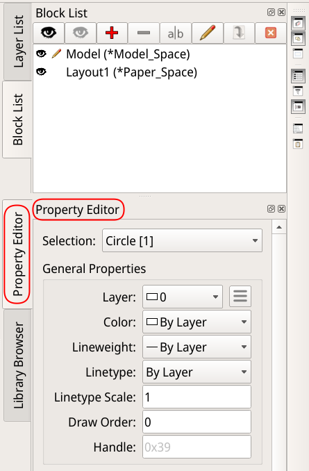
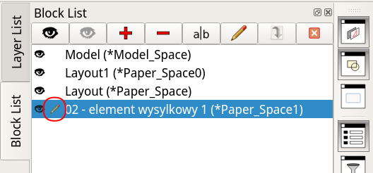
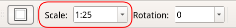

= Przewodnik podstaw QCAD'a Pro
:sectnums:
:sectnumlevels: 5
:toc: left
:toclevels: 5
:toc-title: Przewodnik podstaw QCAD’a Pro

== Wprowadzenie
Ten przewodnik przedstawia podstawy QCAD'a. Wiele efektów w programie QCAD można osiągnąć na wiele sposobów.

Przewodnik nie jest wyczerpującą encyklopedią programu, a raczej stara się przedstawić jeden, wyważony, łatwy w użyciu sposób produkji rysunków technicznych.

Podane procedury skupiają się na użyciu myszy, ograniczając użycie klawiatury do koniecznego minimum. Powodem jest to aby uczynić naukę podstaw QCAD'a jak najłatwiejszą, kosztem szybkości rysowania.

=== Konwencje

==== Ścieżki dostępu
Narzędzia dostępne w programie można wybrać na wiele sposobów. Na przykład, to samo narzędzie można wybrać z menu tekstowego lub klikając ikonę na palecie narzędzi. W większości przypadków, dla uproszczenia i jednoznaczności komunikacji niniejszy przewodnik ogranicza się do wybierania narzędzi z menu tekstowego.

Dotarcie do właściwego narzędzia, opcji lub komendy zwykle wymaga kilku kroków, o których sekwencji można myśleć jako o "ścieżce dostępu". Do reprezentacji tych ścieżek ten przewodnik używa konwencji zilustrowanej następującym przykładem:
====
_Edit > *Drawing preferences* > General > Drawing Unit > Measurement system_
====

Niektóre z członów ścieżki mogą się odnosić do tekstowych menu, a inne do opcji lub pól w oknach dialogowych. Powyższa, przykładowa ścieżka pozwala na znalezienie pola do ustawienia systemu miar. Jest ona zilustrowana na zrzucie ekranu poniżej; zauważ jak segmenty ścieżki korespondują do elementów zaznaczonych na poniższej ilustracji:

.Przykładowa ścieżka dostępu
image::img/tool_selection_paths.png[Przykładowa ścieżka dostępu - ilustracja, align="center"]

Ta konwencja jest używana gdzie jest to tylko możliwe. Tylko w miejscach gdzie jest ona niewystarczająca przewodnik ucieka się do zrzutów ekranu.

==== Klikanie
`LMB`:: Pojedyncze kliknięcie lewego klawisza myszy (_Left Mouse Button_).
`LMBx2`:: Dwukrotne kliknięcie lewego klawisza myszy.
`RMB`:: Pojedyncze kliknięcie prawego klawisza myszy (_Right Mouse Button_).

==== Panele
Gdy przewodnik mówi o _Block List_,  _Layer List_ lub _Property Editor_, to odnosi się on do paneli po prawej stronie ekranu.

Rozdział xref:#kluczowe-panele[Włącz kluczowe panele] opisuje jak je włączyć i gdzie je znaleźć.

==== Domyślne ustawienia

W wielu oknach dialogowych przewodnik rekomenduje zmianę pewnych pól, ale ignoruje inne, które mogą być w danym oknie obecne.

W takim przypadku pozostaw the "niewymienione" pola jak są  - chyba, że już je znasz i wiesz jakie są ich funkcje i konsekwencje zmiany ich wartości.

=== Proces rysowania

Przed przystąpieniem do rysowania, upewnij się, że program jest właściwie skonfigurowany, wykonując kroki z rozdziału xref:#wstepna-konfiguracja-programu[Skonfiguruj QCAD'a].

Process tworzenia nowego rysunku sprowadza się do następujących faz:

* xref:#nowy-rysunek[Stwórz nowy rysunek]
* xref:#parametry_rysunku[Ustaw parametry rysunku]
* xref:#model[Narysuj model]
* xref:#prezentacja[Przedstaw model na wydruku]

Każda z tych faz opisana jest w indywidualnych rozdziałach poniżej.

[#wstepna-konfiguracja-programu]
== Skonfiguruj QCAD'a

Instrukcje w tej sekcji zwykle wystarczy wykonać tylko raz, jako że ustawiają one konfigurację całego programu i dla wszystkich nowo tworzonych rysunków. Może się zdarzyć, że po re-instalacji lub po instalacji nowszej wersji programu, niektóre z ustawień trzeba będzie przejrzeć i powtórzyć.

[#kluczowe-panele]
=== Włącz kluczowe panele
Upewnij się, że powyższe opcje są zaznaczone/aktywne:

* _View > Block List_
* _View > Layer List_
* _View > Property Editor_

Gdy te opcje są zaznaczone, korespondujące panele powinny być widoczne po prawej stronie ekranu, wyglądając podobnie jak na poniższych ilustracjach. Zauważ, że rozmieszczenie paneli i ich "zakładek" różni się między dwiema ilustracjami. Wynika to z tego, że to rozmieszczenie można zmieniać, tak aby dostęp do nich był najwygodniejszy:

image::img/key_panels_all_overlapping.png[float="left"]

=== Wyłącz siatkę

.Dlaczego?
[%collapsible]
====
Siatka rzadko kiedy jest przydatna, a zwykle wchodzi w drogę.

Siatka jest matrycą punktów rozmieszczonych w modelu w równych, pre-definiowanych odstępach. Punkty te mogą być użyte do zgrubnego rozmieszczania obiektów, służąc jako punkty automatycznie przyciągając kursor. W teorii mają one ułatwić rysowanie, ale w praktyce potrzebujemy punktów wynikających z rozmiarów rysowanych obiektów, takich jak końce lini, środki okręgów lub punkty przecięcia lini. Takie punkty, rzadko kiedy wypadają w miejscach punktów siatki.

Jeśli punkt, który naprawdę nas interesuje (np. punkt przecięcia jakiejś lini z okręgiem) wypada blisko punktu siatki, to jest ryzyko, że wskazując go, np. jako początek lub koniec nowo rysowanej lini, automatyczne przyciąganie może nam przyciągnąć kursor do punktu siatki zamiast punktu naszego zainteresowania. W najlepszym przypadku zauważymy to i skorygujemy (kosztem kilku zbędnych kroków). W najgorszym, całkiem prawdopodobnym przypadku, możemy tej niedokładności nie zauważyć. Niewłaściwa pozycja pozostawiona w rysunku i wielokrotnie traktowana jako punkt odniesiena dla kolejnych punktów odniesiena może propagować nawarstwiający się błąd, który będzie tym kosztowniejszy do naprawy im więcej czasu upłynie do jego wykrycia.
====

==== Wyłącz wyświetlanie siatki
_Edit > *Application* Preferences > *Defaults for New Drawings* > Grid_:

* Odznacz _Display grid_ w panelach po prawej stronie: _Viewport 1_, _Vieport 2_, _Viewport 3_, _Viewport 4_.

Wyłączenie siatki w tym miejscu spowoduje, że nie będzie ona widoczna w _nowo_ utworzonych rysunkach. Jeśli masz już istniejący rysunek na ekranie, i chcesz wyłączyć siatkę w nim, powtórz powyższy krok w lokacji _Edit > *Drawing Preferences* > General > Grid_.

==== Wyłącz automatyczne przyciąganie do punktów siatki
_Edit > Application Preferences > Snap > Auto snap_:

* Odznacz _Grid points_.

==== Ustaw kolor wydruku
_Edit > Application Preferences > Default for New Drawings > Printing - Colors_

* Zaznacz _Black / white_.

==== Wyłącz wyświetlanie "niedrukowalnych" warstw w podglądzie wydruku
_Edit > Application Preferences > File > Print Preview_:

* Zaznacz _Show only plottable layers_ ("Pokazuj tylko drukowalne warstwy").

xref:#niedrukowalna-warstwa[Co to jest drukowalna i niedrukowalna warstwa?]

[#nowy-rysunek]
== Stwórz nowy rysunek
_File > New_.

[#parametry-rysunku]
== Ustaw parametry rysunku

=== Wybierz jednostki
_Edit > *Drawing preferences* > General > Drawing Unit_:

_Drawing unit_:: Jednostki używane w modelu i w wymiarach na wydruku. Dla rysunków stali lub drobnych, precyzyjnych przedmiotów wybierz milimetry, dla rysunków obiektów murowanych lub drewnianych wybierz centymetry.
_Paper unit_:: Jednostki używane do określania rozmiaru papieru oraz wymiarów tabliczek i ramek. Zawsze ustaw milimetry.
_Measurement system_:: Jednostki określające grubości linii i odstępy kreskowania  , _Metric_ (metryczny, czyli SI: centymetry, milimetry) lub _Imperial_ (stopy, cale).

[#model]
== Narysuj model

Używając narzędzi rysowania, narysuj obiekty, które są tematem twojego rysunku. Pamiętaj, że w modelu nie przejmujemy się skalą, bo w nim wszystko rysujemy w skali 1:1.

Ostateczne/czyste wymiary i opisy zostaną dodane później.

Jeśli posiadanie kilku kluczowyw opisów lub wymiarów w modelu ułatwi jego rysowanie, możesz je dodać na xref:glossary.adoc#niedrukowalna-warstwa[niedrukowalnej warstwie].

Trudno jest podać procedurę rysowania krok po kroku, jako że każdy rysunek jest inny. Z tego powodu, rozdział ten podaje jedynie kluczowe wskazówki, które powinny uczynić rysowanie łatwiejszym.

=== Przejdź do "przestrzeni modelu":

`LMBx2` _Block List > Model_:

.Wybierz "Model space"
image::img/model_space.png[]

=== Ograniczaj ręczne kalkulacje do absolutnego minimum
Pozwól QCAD'owi robić jak najwięcej pracy za Ciebie zawsze szukając sposobów na to aby:

* wykonywać jak najmniej ręcznych kalkulacji,
* wpisywać jak najmniej parametrów z klawiatury.

Oszczędzi Ci to dużo czasu i wysiłku. Te "sposoby" sprowadzają się do takiego rysowania, aby móc maksymalnie polegać na przyciąganiu do punktów takich jak końce linii, czy punkty przecięcia, zamiast wprowadzania współrzędnych ręcznie.

// todo specific examples, tips

[#prezentacja]
== Przedstaw model na wydruku
Innymi słowy: przygotuj prezentację. Dopiero tutaj będziemy myśleć o skali, wymiarach i opisach.

=== Stwórz nową stronę
_Block > Add Layout Block_:

* Nazwij nową stronę w polu _Layout name_, np. "02 - rygiel 1", albo "03 - słup 2".
* Zignoruj pole _Order_.

Upewnij się, że nowo utworzona strona jest aktywna w panelu _Block List_ (ma wyświetloną ikonę ołówka). Jeśli nie jest, kliknij jej nazwę dwa razy:

.Nowa strona jest aktywna

To automatycznie włącza podgląd wydruku. W tej chwili, strona może jeszcze nie być widoczna na ekranie - naprawimy to za moment.

=== Ustaw rozmiar i orientację strony
_Edit > *Drawing preferences* > Printing > Page_:

* Ustaw orientację strony w _Page Orientation_.
* Ustaw rozmiar papieru w _Paper > Paper size_.

=== Wycentruj stronę na ekranie
Kliknij ikonę _Auto Center_ na pasku narzędzi:

.Auto Center
image::img/presentation_auto_center.png[]

=== Dodaj warstwę dla widoków
_Layer > Add Layer_:

* Nazwij warstwę "widoki" w polu _Layer name_.
* Wybierz kolor, np. niebieski (_Blue_) w polu _Color_.
* Ustaw typ lini na kreskowany (_ISO dash_) w polu _Linetype_.
* Odznacz opcję _Plottable_.

[#nowy-widok]
=== Dodaj widok elementu

==== Wejdź na warstwę "widoki"
// todo common operations
Upewnij się, że warstwa "widoki" jest aktywna w _Layer list_. Jeśli nie jest to `LMB` jej nazwę w panelu _Layer list_.

==== Zacznij dodawać widok
Dodaj widok elementu, wybierając _Draw > Viewport > Add vieport_.

To chwilowo wyłącza podgląd wydruku (z białym tłem) i przenosi Cię do podglądu modelu (z czarnym tłem).

==== Nadaj widokowi skalę
Wprowadź skalę w jakiej chcesz przedstawić element na stronie:

.Ustawianie skali widoku w momencie jego tworzenia

==== Zaznacz obrys widoku
Program czeka teraz aż zaznaczysz prostokątny obszar zawierający element, który chcesz przedstawić na stronie. Pamiętaj, że możesz przesuwać, pomniejszać i powiększać podgląd modelu, żeby wygodniej i bardziej precyzyjnie zaznaczyć potrzebny obszar.

Zaznacz obrys nieco większy niż sam element, klikając w czarne tło:

* `LMB` w jednym rogu obrysu,
* `LMB` w rogu po przekątnej.

To zabiera Cię z powrotem do podglądu wydruku (z białym tłem).

==== Umieść widok na stronie
Program czeka na wskazanie pozycji gdzie chcesz umieścić widok elementu. Poruszaj kursorem myszy i zauważ, że widok elementu jest do niego "przyklejony" i rusza się razem z nim.

* Przesuń kursor myszy na miejsce gdzie widok ma być umieszczony.
* `LMB`, żeby "zakotwiczyć" (wkleić) widok na stronie.

==== Skoryguj pozycję widoku (jeśli trzeba)
Jeśli potrzebujesz przesunąć widok w inne miejsce na stronie:

* Zaznacz widok przez kliknięcie elementu przedstawionego w widoku.
* To spowoduje wyświetlenie granatowych "uchwytów" - kwadratów w narożnikach i dwóch "kropek" wewnątrz obrysu.
* "Złap" za środkową kropkę (wciśnij i przytrzymaj `LMB`) i pociągnij ją tam gdzie chcesz umieścić widok.
* Puść `LMB`, żeby zakotwiczyć widok.

==== Skoryguj skalę widoku
Usuń widok i stwórz go od nowa z nową skalą (jak opisane w sekcji xref:#nowy-widok[Dodaj widok elementu]).

Usunięcie widoku:

* Zaznacz widok pojedynczym kliknięciem `LMB`.
* Wciśnij klawisz _Delete_ na klawiaturze.

=== Zwymiaruj elementy

==== Stwórz warstę dla wymiarów
Zignoruj, jeśli warstwa "wymiary - papier" już istnieje.

_Layer > Add Layer_:

* _Layer name_ (nazwa warstwy): "wymiary - papier"
* _Color_ (kolor linii): _Yellow_
* _Lineweight_ (grubość linii): _0.18mm (ISO)_
* _Linetype_ (typ linii): _Continuous_ (ciągła)
* _Plottable_ (drukowalna): tak, zaznacz
* _Snappable_ (przyciągalna): tak, zaznacz

.Dlaczego taka nazwa?
[%collapsible]
====
W niektórych przypadkach może być użyteczne stworzenie niedrukowalnej warstwy z "roboczymi" wymiarami przydatnymi do wyświetlania w modelu. Taka warstwa zostałaby nazwana "wymiary - model", więc w bieżącej dodajemy kwalifikator "- papier" aby odróżnić te dwie warstwy.
====

==== Wejdź na warstwę "wymiary - papier"
// todo common operations
Upewnij się, że warstwa "wymiary - papier" jest aktywna w _Layer list_. Jeśli nie jest to `LMB` jej nazwę w panelu _Layer list_.

==== Nadaj wymiar elementowi

* Wybierz narzędzie do wymiarowania.
* Upewnij się, że na pasku ustawień narzędzia skala (_Scale_) jest ustawiona na _Auto_:
image:img/tool_bar_dimensions_scale_auto.png[]
* Nadaj elementowi wymiar:
** `LMB` pierwszy punkt wymiaru,
** `LMB` drugi punkt wymiaru,
** `LMB` na papierze w jakimś dystansie od elementu, żeby "zakotwiczyć" linię wymiarową.

include::glossary.adoc[]